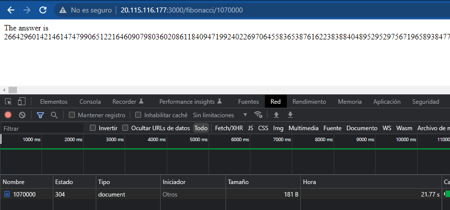
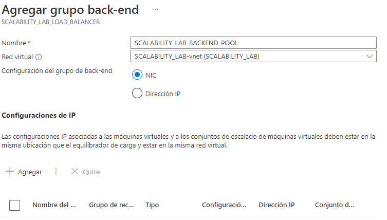
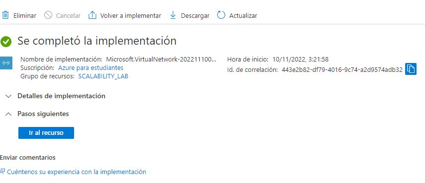

### Escuela Colombiana de Ingeniería
### Arquitecturas de Software - ARSW

## Integrantes
* #### Cristian Camilo Ruiz
* #### Deivid Sebastián Medina

## Escalamiento en Azure con Maquinas Virtuales, Sacale Sets y Service Plans

### Dependencias
* Cree una cuenta gratuita dentro de Azure. Para hacerlo puede guiarse de esta [documentación](https://azure.microsoft.com/es-es/free/students/). Al hacerlo usted contará con $100 USD para gastar durante 12 meses.

### Parte 0 - Entendiendo el escenario de calidad

Adjunto a este laboratorio usted podrá encontrar una aplicación totalmente desarrollada que tiene como objetivo calcular el enésimo valor de la secuencia de Fibonnaci.

**Escalabilidad**
Cuando un conjunto de usuarios consulta un enésimo número (superior a 1000000) de la secuencia de Fibonacci de forma concurrente y el sistema se encuentra bajo condiciones normales de operación, todas las peticiones deben ser respondidas y el consumo de CPU del sistema no puede superar el 70%.

### Parte 1 - Escalabilidad vertical

1. Diríjase a el [Portal de Azure](https://portal.azure.com/) y a continuación cree una maquina virtual con las características básicas descritas en la imágen 1 y que corresponden a las siguientes:
    * Resource Group = SCALABILITY_LAB
    * Virtual machine name = VERTICAL-SCALABILITY
    * Image = Ubuntu Server 
    * Size = Standard B1ls
    * Username = scalability_lab
    * SSH publi key = Su llave ssh publica


Rta//


2. Para conectarse a la VM use el siguiente comando, donde las `x` las debe remplazar por la IP de su propia VM (Revise la sección "Connect" de la virtual machine creada para tener una guía más detallada).

    `ssh scalability_lab@xxx.xxx.xxx.xxx`

Rta//


3. Instale node, para ello siga la sección *Installing Node.js and npm using NVM* que encontrará en este [enlace](https://linuxize.com/post/how-to-install-node-js-on-ubuntu-18.04/).

R//


4. Para instalar la aplicación adjunta al Laboratorio, suba la carpeta `FibonacciApp` a un repositorio al cual tenga acceso y ejecute estos comandos dentro de la VM:

    `git clone <your_repo>`

    `cd <your_repo>/FibonacciApp`

    `npm install`

Rta//

```
    git clone https://github.com/DeividMedina30/ARSW_Lab_09_Medina_Ruiz.git
```

```
    cd ARSW_Lab_09_Medina_Ruiz/FibonacciApp
```


```
    nvm install node
```


```
    npm install
```


5. Para ejecutar la aplicación puede usar el comando `npm FibinacciApp.js`, sin embargo una vez pierda la conexión ssh la aplicación dejará de funcionar. Para evitar ese compartamiento usaremos *forever*. Ejecute los siguientes comando dentro de la VM.

    ` node FibonacciApp.js`

Rta//

```
    node FibonacciApp.js
```


6. Antes de verificar si el endpoint funciona, en Azure vaya a la sección de *Networking* y cree una *Inbound port rule* tal como se muestra en la imágen. Para verificar que la aplicación funciona, use un browser y user el endpoint `http://xxx.xxx.xxx.xxx:3000/fibonacci/6`. La respuesta debe ser `The answer is 8`.


Rta//


7. La función que calcula en enésimo número de la secuencia de Fibonacci está muy mal construido y consume bastante CPU para obtener la respuesta. Usando la consola del Browser documente los tiempos de respuesta para dicho endpoint usando los siguintes valores:
    * 1000000
    * 1010000
    * 1020000
    * 1030000
    * 1040000
    * 1050000
    * 1060000
    * 1070000
    * 1080000
    * 1090000    

Rta//

### - 1000000


### - 1010000


### - 1020000


### - 1030000


### - 1040000


### - 1050000


### - 1060000


### - 1070000


### - 1080000


### - 1090000


8. Dírijase ahora a Azure y verifique el consumo de CPU para la VM. (Los resultados pueden tardar 5 minutos en aparecer).


Rta//


9. Ahora usaremos Postman para simular una carga concurrente a nuestro sistema. Siga estos pasos.
    * Instale newman con el comando `npm install newman -g`. Para conocer más de Newman consulte el siguiente [enlace](https://learning.getpostman.com/docs/postman/collection-runs/command-line-integration-with-newman/).
    * Diríjase hasta la ruta `FibonacciApp/postman` en una maquina diferente a la VM.
    * Para el archivo `[ARSW_LOAD-BALANCING_AZURE].postman_environment.json` cambie el valor del parámetro `VM1` para que coincida con la IP de su VM.
    * Ejecute el siguiente comando.

    ```
    newman run ARSW_LOAD-BALANCING_AZURE.postman_collection.json -e [ARSW_LOAD-BALANCING_AZURE].postman_environment.json -n 10 &
    newman run ARSW_LOAD-BALANCING_AZURE.postman_collection.json -e [ARSW_LOAD-BALANCING_AZURE].postman_environment.json -n 10
    ```

Rta//

```
    npm install -g newman
```


```
    cd ARSW_Lab_09_Medina_Ruiz/FibonacciApp/postman/part1
```


```
newman run ARSW_LOAD-BALANCING_AZURE.postman_collection.json -e [ARSW_LOAD-BALANCING_AZURE].postman_environment.json -n 10 & newman run ARSW_LOAD-BALANCING_AZURE.postman_collection.json -e [ARSW_LOAD-BALANCING_AZURE].postman_environment.json -n 10
```


10. La cantidad de CPU consumida es bastante grande y un conjunto considerable de peticiones concurrentes pueden hacer fallar nuestro servicio. Para solucionarlo usaremos una estrategia de Escalamiento Vertical. En Azure diríjase a la sección *size* y a continuación seleccione el tamaño `B2ms`.


Rta//

Se hicieron los cambios y con el fin de que si hubieran quedado los cambios correctamente
Se decide reiniciar la máquina.


11. Una vez el cambio se vea reflejado, repita el paso 7, 8 y 9.

Rta//

### Repitiendo Paso 7

### - 1000000


### - 1010000


### - 1020000


### - 1030000


### - 1040000


### - 1050000


### - 1060000


### - 1070000



### - 1080000


### - 1090000


### Repitiendo Paso 8


### Repitiendo Paso 9


12. Evalue el escenario de calidad asociado al requerimiento no funcional de escalabilidad y concluya si usando este modelo de escalabilidad logramos cumplirlo.

Rta//

Si se logró, ya que la inicio como no teníamos escalabilidad, veíamos que postman se quedaba
un tiempo interminable y no avanzaba.
Por otro lado cuando cambiamos el tamaño vemos como pasamos con un tiempo mínimo de respuesta
de 19.2 s a un máximo de 37.9 s.

13. Vuelva a dejar la VM en el tamaño inicial para evitar cobros adicionales.

Rta//


**Preguntas**

1. ¿Cuántos y cuáles recursos crea Azure junto con la VM?
2. ¿Brevemente describa para qué sirve cada recurso?
3. ¿Al cerrar la conexión ssh con la VM, por qué se cae la aplicación que ejecutamos con el comando `npm FibonacciApp.js`? ¿Por qué debemos crear un *Inbound port rule* antes de acceder al servicio?
4. Adjunte tabla de tiempos e interprete por qué la función tarda tando tiempo.
5. Adjunte imágen del consumo de CPU de la VM e interprete por qué la función consume esa cantidad de CPU.
6. Adjunte la imagen del resumen de la ejecución de Postman. Interprete:
    * Tiempos de ejecución de cada petición.
    * Si hubo fallos documentelos y explique.
7. ¿Cuál es la diferencia entre los tamaños `B2ms` y `B1ls` (no solo busque especificaciones de infraestructura)?
8. ¿Aumentar el tamaño de la VM es una buena solución en este escenario?, ¿Qué pasa con la FibonacciApp cuando cambiamos el tamaño de la VM?
9. ¿Qué pasa con la infraestructura cuando cambia el tamaño de la VM? ¿Qué efectos negativos implica?
10. ¿Hubo mejora en el consumo de CPU o en los tiempos de respuesta? Si/No ¿Por qué?
11. Aumente la cantidad de ejecuciones paralelas del comando de postman a `4`. ¿El comportamiento del sistema es porcentualmente mejor?

Rta//

1. De acuerdo con la información que observamos en el grupo de recursos, vemos que se
crearon 7 recursos. Sus nombres se aprecian mejor en la imagen.


2.   

* SCALABILITY_LAB-vnet

  Hace referencia a la red virtual.

* vertical-scalabil695

  Hace referencia a la interfaz de red.

* VERTICAL-SCALABILITY

   Hace referencia a la máquina virtual creada.

* VERTICAL-SCALABILITY-ip

   Hace referencia a la dirección ip pública.

* VERTICAL-SCALABILITY-nsg

   Hace referencia a el grupo de seguridad de red

* VERTICAL-SCALABILITY_disk1_8b818b4777b54bea844348392256e02d

   Hace referencia al disco de la máquina virtual.

* VERTICAL-SCALABILITY_key

   Hace referencia a la clave SSH.

3. 

La aplicación se cae por la sencilla razón de que al momento de cerrar la conexión SSH,
esta cierra automáticamente la ejecución de la aplicación.

La razón para crear un Inbound port rule antes de acceder al servicio, es que debido a que el
puerto se encuentra cerrado y no va a permitir consultas.

4. 

La función tarda demasiado debido a que no se esta implementando alguna forma de guardar
valores anteriores, ya sea guardando su estado, llevando un diccionario de valores o usando funciones recursivas,
por lo tanto, cada consulta debe calcular el valor desde 0 haciendo
que se lleve el consumo de la CPU demasiado alto.


5. 

Se puede conlcuir que consume mucha cpu, ya que la función no se hace de forma recursiva.


6. 

Primero que nada cabe recalcar que las siguente toma de datos se hizo en la maquina
virtual Labtainer con sistema operativo Ubuntu en virtual Box.

Se ve que el tiempo total de duración de ejecución fue de 3 minutos con 31 segundos.

Tiempo promedio de respuesta fue de 23.9 s

Los fallos que se tuvieron fueron 4, se concluye que suceden en el momento que la aplciación recibe una
sobrecarga de peticiones por parte del cliente.


7. 

Fuente

https://learn.microsoft.com/es-es/azure/virtual-machines/sizes-b-series-burstable

* "B1ls solo admite imágenes de Linux y, si implementa cualquier otra imagen del sistema operativo, es posible que no obtenga la mejor experiencia del cliente."


8. 

Para el caso de Postman si sirve pero no mucho, ya que no se nota un cambio significativo
en la reducción de tiempo, por otro lado en costos vemos que si incrementa bastante.

9. 

El primer cambio negativo que se observa es el de costos. Por otro lado si la petición 
que realice el cliente fuera constante el tiempo que tarda en levantar el nuevo tamaño es 
muy largo.

10. 

En el tiempo de respuesta variaba muy poco, algunas consultas si eran mejor, mientras que
otras simplemente no se notaba el cambio.

En el consumo de CPU, si notamos mejoras, ya que la primera vez que se realizó las pruebas, se observa
un pico de consumo promedio de 71.92%, y en la segunda prueba 47.75% 


11. 


### Parte 2 - Escalabilidad horizontal

#### Crear el Balanceador de Carga

Antes de continuar puede eliminar el grupo de recursos anterior para evitar gastos adicionales y realizar la actividad en un grupo de recursos totalmente limpio.

1. El Balanceador de Carga es un recurso fundamental para habilitar la escalabilidad horizontal de nuestro sistema, por eso en este paso cree un balanceador de carga dentro de Azure tal cual como se muestra en la imágen adjunta.


Rta//


2. A continuación cree un *Backend Pool*, guiese con la siguiente imágen.


Rta//




3. A continuación cree un *Health Probe*, guiese con la siguiente imágen.


Rta//


4. A continuación cree un *Load Balancing Rule*, guiese con la siguiente imágen.


Rta//


5. Cree una *Virtual Network* dentro del grupo de recursos, guiese con la siguiente imágen.


Rta//





#### Crear las maquinas virtuales (Nodos)

Ahora vamos a crear 3 VMs (VM1, VM2 y VM3) con direcciones IP públicas standar en 3 diferentes zonas de disponibilidad. Después las agregaremos al balanceador de carga.

1. En la configuración básica de la VM guíese por la siguiente imágen. Es importante que se fije en la "Avaiability Zone", donde la VM1 será 1, la VM2 será 2 y la VM3 será 3.


Rta//


2. En la configuración de networking, verifique que se ha seleccionado la *Virtual Network*  y la *Subnet* creadas anteriormente. Adicionalmente asigne una IP pública y no olvide habilitar la redundancia de zona.


Rta//


3. Para el Network Security Group seleccione "avanzado" y realice la siguiente configuración. No olvide crear un *Inbound Rule*, en el cual habilite el tráfico por el puerto 3000. Cuando cree la VM2 y la VM3, no necesita volver a crear el *Network Security Group*, sino que puede seleccionar el anteriormente creado.


4. Ahora asignaremos esta VM a nuestro balanceador de carga, para ello siga la configuración de la siguiente imágen.


5. Finalmente debemos instalar la aplicación de Fibonacci en la VM. para ello puede ejecutar el conjunto de los siguientes comandos, cambiando el nombre de la VM por el correcto

```
git clone https://github.com/daprieto1/ARSW_LOAD-BALANCING_AZURE.git

curl -o- https://raw.githubusercontent.com/creationix/nvm/v0.34.0/install.sh | bash
source /home/vm1/.bashrc
nvm install node

cd ARSW_LOAD-BALANCING_AZURE/FibonacciApp
npm install

npm install forever -g
forever start FibonacciApp.js
```

Realice este proceso para las 3 VMs, por ahora lo haremos a mano una por una, sin embargo es importante que usted sepa que existen herramientas para aumatizar este proceso, entre ellas encontramos Azure Resource Manager, OsDisk Images, Terraform con Vagrant y Paker, Puppet, Ansible entre otras.

#### Probar el resultado final de nuestra infraestructura

1. Porsupuesto el endpoint de acceso a nuestro sistema será la IP pública del balanceador de carga, primero verifiquemos que los servicios básicos están funcionando, consuma los siguientes recursos:

```
http://52.155.223.248/
http://52.155.223.248/fibonacci/1
```

2. Realice las pruebas de carga con `newman` que se realizaron en la parte 1 y haga un informe comparativo donde contraste: tiempos de respuesta, cantidad de peticiones respondidas con éxito, costos de las 2 infraestrucruras, es decir, la que desarrollamos con balanceo de carga horizontal y la que se hizo con una maquina virtual escalada.

3. Agregue una 4 maquina virtual y realice las pruebas de newman, pero esta vez no lance 2 peticiones en paralelo, sino que incrementelo a 4. Haga un informe donde presente el comportamiento de la CPU de las 4 VM y explique porque la tasa de éxito de las peticiones aumento con este estilo de escalabilidad.

```
newman run ARSW_LOAD-BALANCING_AZURE.postman_collection.json -e [ARSW_LOAD-BALANCING_AZURE].postman_environment.json -n 10 &
newman run ARSW_LOAD-BALANCING_AZURE.postman_collection.json -e [ARSW_LOAD-BALANCING_AZURE].postman_environment.json -n 10 &
newman run ARSW_LOAD-BALANCING_AZURE.postman_collection.json -e [ARSW_LOAD-BALANCING_AZURE].postman_environment.json -n 10 &
newman run ARSW_LOAD-BALANCING_AZURE.postman_collection.json -e [ARSW_LOAD-BALANCING_AZURE].postman_environment.json -n 10
```

**Preguntas**

* ¿Cuáles son los tipos de balanceadores de carga en Azure y en qué se diferencian?, ¿Qué es SKU, qué tipos hay y en qué se diferencian?, ¿Por qué el balanceador de carga necesita una IP pública?
* ¿Cuál es el propósito del *Backend Pool*?
* ¿Cuál es el propósito del *Health Probe*?
* ¿Cuál es el propósito de la *Load Balancing Rule*? ¿Qué tipos de sesión persistente existen, por qué esto es importante y cómo puede afectar la escalabilidad del sistema?.
* ¿Qué es una *Virtual Network*? ¿Qué es una *Subnet*? ¿Para qué sirven los *address space* y *address range*?
* ¿Qué son las *Availability Zone* y por qué seleccionamos 3 diferentes zonas?. ¿Qué significa que una IP sea *zone-redundant*?
* ¿Cuál es el propósito del *Network Security Group*?
* Informe de newman 1 (Punto 2)
* Presente el Diagrama de Despliegue de la solución.

Rta//

1. 
Encontramos 3 tipos de balanceadores de carga.
* Load Balancer estándar: 

"Standard Load Balancer enruta el tráfico dentro y entre regiones y a las zonas de disponibilidad para obtener una gran resiliencia."

* Gateway Load Balancer:

"Habilite escenarios que necesitan encadenamiento de servicios como el análisis, la protección contra DDoS, firewall y mucho más."

* Load Balancer básico

"Admite aplicaciones a pequeña escala que no necesitan alta disponibilidad o redundancia."

Fuente:

https://azure.microsoft.com/es-es/products/load-balancer/#features

2. 

"El grupo de back-end es un componente crítico del equilibrador de carga. El grupo de back-end define el grupo de recursos que atenderán el tráfico para una regla de equilibrio de carga determinada"

Fuente:

https://learn.microsoft.com/en-us/azure/load-balancer/backend-pool-management

3. 

"Azure Load Balancer usa sondeos de estado para supervisar el estado de las instancias de back-end. En este artículo, aprenderá a administrar sondeos de estado para Azure Load Balancer."

Fuente:

https://learn.microsoft.com/en-us/azure/load-balancer/manage-probes-how-to

4. 

Load Balancer rules

"Se usa una regla de equilibrador de carga para definir cómo se distribuye el tráfico entrante a todas las instancias dentro del grupo de back-end."

Fuente:

https://learn.microsoft.com/en-us/azure/load-balancer/components

5. 

Virtual Network

"Azure Virtual Network (VNet) es el bloque de creación fundamental de una red privada en Azure. VNet permite muchos tipos de recursos de Azure, como Azure Virtual Machines (máquinas virtuales), para comunicarse de forma segura entre usuarios, con Internet y con las redes locales."

Subnet

"La delegación de subred permite designar una subred concreta para el servicio PaaS de Azure que se prefiera e insertarla en una red virtual. La delegación de subred proporciona al cliente control total al cliente de la administración de la integración de los servicios de Azure en sus redes virtuales."

address space

"Al crear una red virtual, debe especificar un espacio de direcciones IP privado personalizado mediante direcciones públicas y privadas (RFC 1918). Azure asigna a los recursos de una red virtual una dirección IP privada desde el espacio de direcciones que usted asigne."

address range

"El intervalo debe estar dentro del espacio de direcciones que ingresó para la red virtual. El rango más pequeño que puede especificar es /29, que proporciona ocho direcciones IP para la subred."

Fuentes:

https://learn.microsoft.com/es-es/azure/virtual-network/virtual-networks-overview

https://learn.microsoft.com/es-es/azure/virtual-network/subnet-delegation-overview

https://learn.microsoft.com/en-us/azure/virtual-network/concepts-and-best-practices

https://learn.microsoft.com/en-us/azure/virtual-network/manage-virtual-network

6. 

Availability Zone

"Están diseñadas para ayudarlo a lograr la confiabilidad de sus cargas de trabajo críticas para el negocio. Azure mantiene múltiples geografías. Estas demarcaciones discretas definen la recuperación ante desastres y los límites de residencia de datos en una o varias regiones de Azure. "

Fuente:

https://learn.microsoft.com/en-us/azure/reliability/availability-zones-overview

7. 

Network Security Group

"Puede usar un grupo de seguridad de red de Azure para filtrar el tráfico de red entre los recursos de Azure en una red virtual de Azure. Un grupo de seguridad de red contiene reglas de seguridad que permiten o deniegan el tráfico de red entrante o el tráfico de red saliente desde varios tipos de recursos de Azure. Para cada regla, puede especificar el origen y el destino, el puerto y el protocolo."

Fuente:

https://learn.microsoft.com/en-us/azure/virtual-network/network-security-groups-overview


